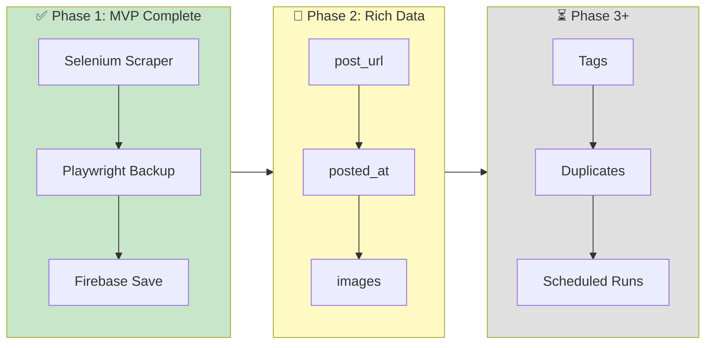
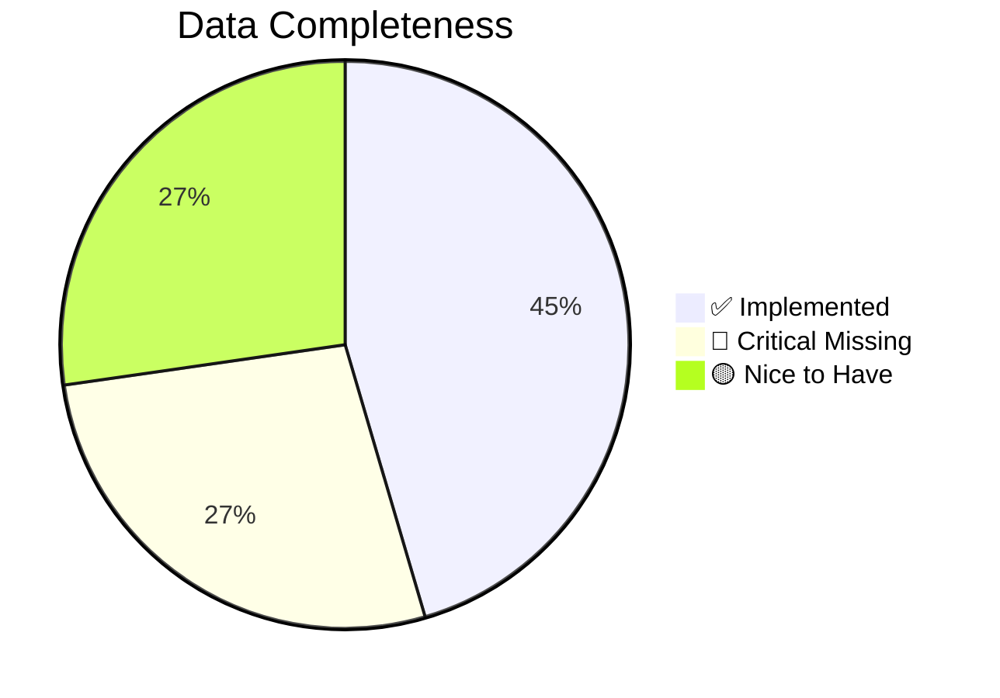
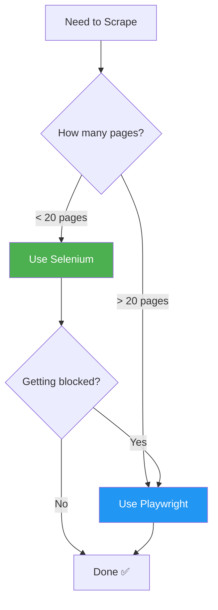

# 📚 QCU Facebook Scraper - Development Guide

> **Purpose:** Living documentation for AI assistants and developers. Tracks current state, decisions, and next steps.

**Last Updated:** February 1, 2026  
**Current Phase:** Phase 1 Complete ✅ → Phase 2: Rich Data 🔄  
**Timezone:** Asia/Manila (PHT / UTC+8)

---

## 🚀 Quick Status



| Metric | Value |
|--------|-------|
| **Posts Scraped** | 47 from 7 pages |
| **Time per Page** | ~20s (Selenium) / ~15s (Playwright) |
| **Total Runtime** | ~2.5 minutes |
| **Firebase** | ✅ Connected (`qcu-unified-network`) |

---

## 📋 Table of Contents

1. [Project Overview](#-project-overview)
2. [Design Principles](#-design-principles)
3. [Current Project Structure](#-current-project-structure)
4. [What Works Now](#-what-works-now)
5. [What's Missing (Next Steps)](#-whats-missing-next-steps)
6. [Display Strategy](#-display-strategy)
7. [Data Schema](#-data-schema)
8. [Scraper Comparison](#-scraper-comparison)
9. [Target Sources](#-target-sources)
10. [Commands Reference](#-commands-reference)
11. [Configuration Files](#-configuration-files)
12. [Firebase Setup](#-firebase-setup)
13. [Legal & ToS Considerations](#-legal--tos-considerations)
14. [Decisions Log](#-decisions-log)
15. [Session History](#-session-history)

---

## 🎯 Project Overview

### What is this?

A Python scraper that:
- Fetches announcements from QCU Facebook pages
- Saves to Firebase Firestore for a mobile app
- Uses Selenium (primary) + Playwright (backup)

### Why build this?

University announcements are scattered across **10+ Facebook pages**. Students miss important info because they can't follow everything. This centralizes announcements into one feed.

### Who maintains it?

- **Lead Architect:** Brent Ford V. Remerata
- **Team:** Platform Technologies Group

---

## 🎨 Design Principles

> Every decision must align with these principles.

| Principle | Description |
|-----------|-------------|
| 🔄 **Scalability** | Add sources via config, not code |
| 🧩 **Simplicity** | Anyone understands in 10 minutes |
| 📖 **Readability** | Code is self-documenting |
| 🔧 **Flexibility** | Behavior changes via JSON config |
| 📚 **Documentation** | Always current and accurate |
| 🛡️ **Resilience** | Never crash, always log |

---

## 📁 Current Project Structure

```
Facebook-Scraper/
├── main.py                      # Entry point - runs all sources
├── test_scraper.py              # System check script
├── requirements.txt             # Python dependencies
├── README.md                    # Quick start guide
├── GUIDE.md                     # This file (detailed docs)
├── QCU Unified Network.md       # Architecture document
│
├── src/
│   ├── __init__.py
│   ├── scraper.py               # ✅ Selenium scraper (PRIMARY)
│   ├── scraper_playwright.py    # ✅ Playwright scraper (BACKUP)
│   └── database.py              # ✅ Firebase operations
│
├── config/
│   ├── sources.json             # ✅ Pages to scrape (7 enabled)
│   ├── settings.json            # ⚠️ Partially used
│   ├── keywords.json            # ⏳ Not yet implemented
│   ├── facebook_cookies.txt     # 🔒 Your FB session (GITIGNORED)
│   └── firebase-key.json        # 🔒 Firebase credentials (GITIGNORED)
│
└── data/
    ├── last_stats.json          # Selenium performance data
    ├── last_stats_playwright.json # Playwright performance data
    └── logs/                    # Empty - for future logging
```

### What Each File Does

| File | Status | Purpose |
|------|--------|---------|
| `main.py` | ✅ Working | Runs all sources, saves to Firebase |
| `src/scraper.py` | ✅ Working | Selenium-based scraper with stats |
| `src/scraper_playwright.py` | ✅ Working | Faster backup scraper |
| `src/database.py` | ✅ Working | Firebase Firestore operations |
| `test_scraper.py` | ✅ Working | Pre-flight checks |
| `config/sources.json` | ✅ Used | 7 Facebook pages configured |
| `config/keywords.json` | ⏳ TODO | For auto-tagging (not implemented) |
| `config/settings.json` | ⚠️ Partial | Some settings used |

---

## ✅ What Works Now

### Latest Run Results (February 1, 2026)

| Page | Posts Found | Time |
|------|-------------|------|
| QCU Main | 6 | 20.7s |
| QCU Registrar | 10 | 20.7s |
| QCU Guidance | 3 | 20.5s |
| QCU Placement | 10 | 20.4s |
| QCU Iskolar Council | 8 | 20.3s |
| QCU Library | 0 | 20.5s |
| QCU Times | 10 | 20.0s |
| **TOTAL** | **47** | **~2.5 min** |

### Current Data Structure (What We Collect)

```json
{
  "post_id": "qcu1994_42ef9169",
  "source_id": "qcu1994",
  "source_name": "qcu1994",
  "title": "Ready to take the next big step...",
  "text": "Full post text here...",
  "scraped_at": "2026-02-01T08:32:11+00:00",
  "content_hash": "47078e181e0..."
}
```

### Features Working

- ✅ Scrape public Facebook pages
- ✅ Cookie authentication (10 cookies loaded)
- ✅ Save posts to Firebase Firestore
- ✅ Performance statistics tracking
- ✅ Headless browser mode
- ✅ Backup scraper (Playwright)

---

## ❌ What's Missing (Next Steps)

### Priority: CRITICAL 🔴

| Feature | Current | Target | Why Needed |
|---------|---------|--------|------------|
| **post_url** | ❌ None | Extract permalink | "View on Facebook" button |
| **posted_at** | ❌ None | Parse "Yesterday at 12:33 PM" | Sort posts by time |
| **images[]** | ❌ None | Extract img URLs | Rich card display |

### Priority: HIGH 🟡

| Feature | Current | Target | Why Needed |
|---------|---------|--------|------------|
| **source.name** | Uses ID | "QCU Main" | Human-readable names |
| **is_pinned** | ❌ None | Detect pinned | Filter old announcements |
| **tags** | ❌ None | URGENT, ENROLLMENT | Filtering in app |

### Priority: FUTURE 🟢

| Feature | Status | Description |
|---------|--------|-------------|
| Duplicate detection | ⏳ | Hash comparison |
| Scheduled runs | ⏳ | GitHub Actions |
| Health monitoring | ⏳ | Alerts on failure |
| Private groups | ⏳ | Phase 2 |

---

## 📱 Display Strategy

**Decision:** Preview Card → Redirect to Facebook

```
┌────────────────────────────────┐
│ 🏛️ QCU Main                   │ ← source.name
│ 📅 Yesterday at 12:33 PM       │ ← posted_at
│                                │
│ Today marks a milestone...     │ ← text_preview
│                                │
│ [THUMBNAIL IMAGE]              │ ← images[0]
│                                │
│     [View on Facebook →]       │ ← post_url
└────────────────────────────────┘
```

**Why this approach:**
- ✅ **Simple** - Don't recreate Facebook, just link to it
- ✅ **Legal** - We drive traffic TO Facebook, not away
- ✅ **Flexible** - FB post changes, our link still works
- ✅ **Scalable** - Less data to store/maintain

---

## 📊 Data Schema

### Target Schema (What We Need)

```json
{
  "post_id": "qcu1994_abc123",
  "title": "First 80 chars...",
  "text": "Full post content",
  "text_preview": "First 200 chars for card display",
  
  "source": {
    "id": "qcu1994",
    "name": "QCU Main",
    "url": "https://facebook.com/qcu1994"
  },
  
  "post_url": "https://facebook.com/.../posts/123",
  "posted_at": "2026-01-31T12:33:00+08:00",
  "images": ["https://scontent...", "..."],
  
  "scraped_at": "2026-02-01T08:00:00Z",
  "content_hash": "sha256:a1b2c3...",
  
  "tags": ["ENROLLMENT", "BSIT"],
  "is_pinned": false
}
```

### Gap Analysis



| Field | Status | Notes |
|-------|--------|-------|
| post_id | ✅ Done | `{source}_{hash}` |
| title | ⚠️ Basic | First 80 chars (need keywords) |
| text | ✅ Done | Full content |
| source.id | ✅ Done | From config |
| source.name | ⚠️ Uses ID | Need display name |
| **post_url** | 🔴 Missing | **CRITICAL** |
| **posted_at** | 🔴 Missing | **CRITICAL** |
| **images** | 🔴 Missing | **CRITICAL** |
| scraped_at | ✅ Done | UTC timestamp |
| content_hash | ✅ Done | SHA-256 |
| tags | ⏳ TODO | Not implemented |
| is_pinned | ⏳ TODO | Not detected |

---

## ⚡ Scraper Comparison

### Performance

| Metric | Selenium (Primary) | Playwright (Backup) |
|--------|-------------------|---------------------|
| **Time per page** | ~21s | ~15s |
| **Posts found** | 6 | 5 |
| **Speed difference** | Baseline | 32% faster |
| **Stability** | ⭐⭐⭐⭐ | ⭐⭐⭐ |

### When to Use Which



### Scale Estimates

| Pages | Selenium | Playwright |
|-------|----------|------------|
| 7 | 2.5 min | 1.7 min |
| 50 | 18 min | 12 min |
| 100 | 36 min | 24 min |

---

## 🎯 Target Sources

### Currently Enabled (7 Public Pages)

| Priority | ID | Name | Type |
|----------|-----|------|------|
| 1 | `qcu1994` | QCU Main | Page |
| 2 | `qcuregistrar` | QCU Registrar | Page |
| 3 | `qcuguidanceunit` | QCU Guidance | Page |
| 4 | `QCUPlacement` | QCU Placement | Page |
| 5 | `qcuiskolarcouncil` | QCU Iskolar Council | Page |
| 6 | `qculibrary` | QCU Library | Page |
| 7 | `qcutimes` | QCU Times | Page |

### Future (Private Groups - Phase 2)

| ID | Name | Type |
|----|------|------|
| `387936581864052` | Group 1 | Private Group |
| `391073628062510` | Group 2 | Private Group |
| `1257895282002910` | Group 3 | Private Group |

> **Note:** Private groups require account membership. Postponed to Phase 2.

---

## 🔧 Commands Reference

### Setup

```bash
# Create virtual environment
python -m venv .venv

# Activate (Windows)
.venv\Scripts\activate

# Install dependencies
pip install -r requirements.txt
```

### Running

```bash
# Quick system check
python test_scraper.py

# Run all sources (headless)
python main.py

# Run single page (Selenium)
python src/scraper.py -p qcu1994 --headless

# Run single page (Playwright)
python src/scraper_playwright.py -p qcu1994

# Interactive test mode
python src/scraper.py
```

---

## ⚙️ Configuration Files

### config/sources.json

```json
{
  "sources": [
    {
      "id": "qcu1994",
      "name": "QCU Main",
      "url": "https://www.facebook.com/qcu1994",
      "type": "page",
      "priority": 1,
      "enabled": true
    }
  ]
}
```

### config/keywords.json

```json
{
  "urgency_keywords": {
    "URGENT": ["urgent", "importante", "emergency"],
    "SUSPENDED": ["suspended", "no classes", "walang pasok"]
  },
  "program_keywords": {
    "BSIT": ["bsit", "information technology"],
    "BSBA": ["bsba", "business administration"]
  }
}
```

> **Status:** Keywords configured but auto-tagging not yet implemented.

---

## 🔥 Firebase Setup

### Current Configuration

| Setting | Value |
|---------|-------|
| Project ID | `qcu-unified-network` |
| Region | `asia-southeast1` |
| Collection | `posts` |
| Mode | Native (NoSQL) |

### Setup Steps

1. Go to [Firebase Console](https://console.firebase.google.com)
2. Create project → `qcu-unified-network`
3. Firestore → Create Database → `asia-southeast1`
4. Project Settings → Service Accounts → Generate Key
5. Save as `config/firebase-key.json`

### Free Tier Limits

| Resource | Free Limit | Our Usage | Status |
|----------|------------|-----------|--------|
| Document Reads | 50,000/day | ~500/day | ✅ Safe |
| Document Writes | 20,000/day | ~100/day | ✅ Safe |
| Storage | 1 GiB | ~50 MB | ✅ Safe |

---

## ⚖️ Legal & ToS Considerations

### Facebook ToS Analysis

| Rule | Our Approach | Risk |
|------|--------------|------|
| "Don't scrape" | We link back to FB | MEDIUM |
| "Don't sell data" | Non-commercial | LOW |
| "Don't fake accounts" | Real cookies | LOW |
| "Don't spam" | Rate limited | LOW |

### Risk Mitigation

1. **Link to original** - Drive traffic TO Facebook
2. **Rate limit** - 20s between pages
3. **Educational use** - School project
4. **No monetization** - Never sell data
5. **Backup plan** - Manual posting if blocked

### Worst Case Scenarios

| Scenario | Likelihood | Impact | Recovery |
|----------|------------|--------|----------|
| Cookie expires | HIGH | Low | Re-export |
| Account suspended | MEDIUM | Medium | New account |
| IP rate-limited | LOW | Low | Wait/VPN |
| Legal action | VERY LOW | High | Educational defense |

---

## 📝 Decisions Log

| Date | Decision | Rationale |
|------|----------|-----------|
| 2026-02-01 | Selenium as primary | More stable than facebook-scraper library |
| 2026-02-01 | Playwright as backup | 32% faster, good for scale |
| 2026-02-01 | Preview Card → Redirect | Simple, legal, scalable |
| 2026-02-01 | Store FB image URLs | Phase 1 simplicity |
| 2026-02-01 | Skip private groups (Phase 1) | Lower risk to start |
| 2026-02-01 | Use PHT timezone | User's local time |
| 2026-02-01 | Continue despite ToS | Educational, non-commercial |

---

## 📅 Session History

### Session 5 - February 1, 2026 (Current)

**Focus:** Documentation alignment, cleanup, planning

**Completed:**
- ✅ Cleaned debug files (`data/debug_*.txt`)
- ✅ Updated all documentation to current state
- ✅ Created consolidated GUIDE.md
- ✅ Aligned README.md and architecture docs

**Key Decisions:**
- Display: Preview Card → Redirect to Facebook
- Images: Store FB URLs directly (Phase 1)
- Legal: Continue with safeguards
- Critical data: post_url, posted_at, images

---

### Session 4 - February 1, 2026

**Focus:** Scraper implementation and testing

**Achievements:**
- ✅ Selenium scraper working (21.85s/page, 6 posts)
- ✅ Playwright scraper working (14.73s/page, 5 posts)
- ✅ Firebase connected and saving
- ✅ 47 posts scraped from 7 pages

**Technical Notes:**
- Abandoned facebook-scraper library (outdated)
- Cookie authentication working (10 cookies)
- Changed Playwright wait strategy (`domcontentloaded`)

---

### Session 3 - February 1, 2026

**Focus:** Requirements clarification

**Decisions Made:**
- Timezone: PHT (UTC+8)
- Title generation: Keyword-based
- Content hash: Full text
- Images: Compress and store
- Alerts: Discord webhooks

---

### Sessions 1-2 - February 1, 2026

**Focus:** Initial setup and planning

- Reviewed architecture document
- Identified 7 public pages + 3 private groups
- Created initial documentation

---

## 🔗 Related Documents

| Document | Purpose |
|----------|---------|
| [README.md](README.md) | Quick start guide |
| [QCU Unified Network.md](QCU%20Unified%20Network.md) | Full architecture |

---

*This document is updated after each development session. Keep it aligned with actual code.*
