# 📚 QCU Facebook Scraper - Development Guide

> **Purpose:** This document serves as the living context for AI assistants and developers working on this project. It tracks progress, decisions, and implementation details.

**Last Updated:** February 1, 2026  
**Current Phase:** Development - Scraper Implementation ✅  
**Timezone:** Asia/Manila (PHT / UTC+8)  
**Scraper Status:** Working! (Selenium + Playwright)

---

## 📋 Table of Contents

1. [Project Overview](#-project-overview)
2. [Design Principles](#-design-principles)
3. [Is This Project Worth Building?](#-is-this-project-worth-building)
4. [Target Facebook Sources](#-target-facebook-sources)
5. [Core Requirements](#-core-requirements)
6. [Technical Architecture](#-technical-architecture)
7. [Duplicate & Reshare Detection](#-duplicate--reshare-detection)
8. [Title Generation Strategy](#-title-generation-strategy)
9. [Image Handling Strategy](#-image-handling-strategy)
10. [Scalability Architecture](#-scalability-architecture)
11. [Health Monitoring & Alerts](#-health-monitoring--alerts)
12. [Source Priority System](#-source-priority-system)
13. [Post Change Tracking](#-post-change-tracking)
14. [Failure Recovery System](#-failure-recovery-system)
15. [RSS & Alternative Methods](#-rss--alternative-methods)
16. [Private Groups Strategy](#-private-groups-strategy)
17. [Firebase Setup Guide](#-firebase-setup-guide)
18. [Dependencies & Requirements](#-dependencies--requirements)
19. [Risk Assessment](#-risk-assessment)
20. [Current Progress](#-current-progress)
21. [Decisions Log](#-decisions-log)
22. [Session History](#-session-history)

---

## 🎯 Project Overview

### What is this project?

A **flexible, scalable** Python-based scraper that:

- Fetches announcements from multiple QCU Facebook pages/groups
- Supports dynamic addition of new sources via JSON config
- Filters by date ranges
- Detects and skips duplicate/reshared content
- Tags posts with keywords (URGENT, BSIT, ENTREP, etc.)
- Generates titles from post content
- Tracks post edits over time
- Uploads to Firebase for the QCU Student Mobile App

### Why does it exist?

University announcements are **fragmented across 10+ Facebook pages** (and growing). Students miss important information because they can't follow everything. This centralizes all announcements into one searchable, filterable feed.

### Who maintains it?

- **Lead Architect:** Brent Ford V. Remerata
- **Team:** Platform Technologies Group

---

## 🎨 Design Principles

> **MEMORIZE THESE.** Every decision must align with these principles.

| Principle | Icon | Description | How to Apply |
|-----------|------|-------------|--------------|
| **Scalability** | 🔄 | System grows without rewrites | Add features/sources via config, not code changes |
| **Simplicity** | 🧩 | Anyone understands in 10 minutes | One responsibility per file, clear naming |
| **Readability** | 📖 | Code is self-documenting | Descriptive names, comments explain "why" not "what" |
| **Flexibility** | 🔧 | Behavior changes via config | No hardcoded values, everything in JSON/env |
| **Documentation** | 📚 | Always current and accurate | Update docs with every code change |
| **Resilience** | 🛡️ | Graceful failure handling | Never crash, always log, always recover |

### The 1-Day Rule

> New features should take **≤1 day** to implement. If it takes longer, the architecture needs improvement.

---

## 🤔 Is This Project Worth Building?

### ✅ YES - Here's Why:

| Reason | Explanation |
|--------|-------------|
| **Real Problem** | Students genuinely miss announcements scattered across 10+ pages |
| **No Existing Solution** | QCU doesn't have a unified notification system |
| **Scalable Impact** | Benefits thousands of students across all programs |
| **Learning Value** | Teaches web scraping, Firebase, API design, Flutter integration |
| **Portfolio Project** | Demonstrates real-world problem solving |
| **Low Cost** | Firebase free tier is sufficient; no server costs if using GitHub Actions |

### ⚠️ Challenges to Consider:

| Challenge | Severity | Mitigation |
|-----------|----------|------------|
| **facebook-scraper is outdated** | HIGH | ~~Has 438 open issues~~. Using Selenium instead ✅ |
| **Selenium may be blocked** | MEDIUM | Playwright backup created ✅ |
| **Facebook actively blocks scrapers** | HIGH | Use cookies, realistic delays, handle blocks gracefully |
| **Private groups need membership** | MEDIUM | Need dedicated account that's a member |
| **Maintenance burden** | MEDIUM | When FB changes HTML, scraper breaks. Need ongoing fixes. |
| **Terms of Service** | LOW-MEDIUM | Educational/non-commercial use. Risk = account suspension, not legal. |

### 🎯 Phased Approach:


---

## 🎯 Target Facebook Sources

### PUBLIC Pages (7 confirmed) - Can scrape without login

| # | ID | Name | URL | Type | Priority |
|---|-----|------|-----|------|----------|
| 1 | `qcu1994` | QCU Main | https://www.facebook.com/qcu1994 | Page | 1 (Highest) |
| 2 | `qcuregistrar` | QCU Registrar | https://www.facebook.com/qcuregistrar | Page | 2 |
| 3 | `qcuguidanceunit` | QCU Guidance | https://www.facebook.com/qcuguidanceunit | Page | 3 |
| 4 | `QCUPlacement` | QCU Placement | https://www.facebook.com/QCUPlacement | Page | 4 |
| 5 | `qcuiskolarcouncil` | QCU Iskolar Council | https://www.facebook.com/qcuiskolarcouncil | Page | 5 |
| 6 | `qculibrary` | QCU Library | https://www.facebook.com/qculibrary | Page | 6 |
| 7 | `qcutimes` | QCU Times | https://www.facebook.com/qcutimes | Page | 7 |

### PRIVATE Groups (3 confirmed) - Need cookies + membership

| # | ID | Name | URL | Type | Priority |
|---|-----|------|-----|------|----------|
| 8 | `387936581864052` | Group 1 | https://www.facebook.com/groups/387936581864052/ | Group | 10 |
| 9 | `391073628062510` | Group 2 | https://www.facebook.com/groups/391073628062510/ | Group | 11 |
| 10 | `1257895282002910` | Group 3 | https://www.facebook.com/groups/1257895282002910/ | Group | 12 |

### Future Sources (Easily Added via JSON)

- BSIT-specific pages
- ENTREP-specific pages
- Department pages
- *(Add to `config/sources.json` - no code changes needed)*

---

## 📋 Core Requirements

### Flexibility Requirements

| Requirement | Implementation | Config File |
|-------------|----------------|-------------|
| Easy to add new URLs | JSON config - just add new entry | `sources.json` |
| Date range filtering | `start_date` and `end_date` parameters | `settings.json` |
| Keyword filtering | Configurable keyword lists | `keywords.json` |
| Skip reshares | Content hash comparison | `settings.json` |
| Skip duplicates | Post ID + text similarity check | Automatic |
| Program-specific tags | Auto-detect: BSIT, ENTREP, BSCE, etc. | `keywords.json` |
| Rate limiting | Configurable delays | `settings.json` |
| Priority ordering | Numeric priority per source | `sources.json` |

---

## 🏗️ Technical Architecture

### System Overview


### Project Structure

```
qcu-news-scraper/
├── 📄 README.md                    # Quick start guide
├── 📄 GUIDE.md                     # This file (development guide)
├── 📄 QCU Unified Network.md       # Architecture document
├── 📄 requirements.txt             # Python dependencies
├── 📄 .env.example                 # Environment variables template
├── 📄 .gitignore                   # Git ignore rules
│
├── 📁 src/                         # Source code
│   ├── 📄 __init__.py
│   ├── 📄 main.py                  # Entry point
│   │
│   ├── 📁 scraper/                 # Scraping modules
│   │   ├── 📄 __init__.py
│   │   ├── 📄 base_scraper.py      # Abstract interface
│   │   ├── 📄 facebook_scraper.py  # Primary scraper
│   │   └── 📄 playwright_backup.py # Backup scraper
│   │
│   ├── 📁 processors/              # Data processing
│   │   ├── 📄 __init__.py
│   │   ├── 📄 duplicate_detector.py
│   │   ├── 📄 sanitizer.py
│   │   ├── 📄 tagger.py
│   │   └── 📄 title_generator.py
│   │
│   ├── 📁 storage/                 # Database operations
│   │   ├── 📄 __init__.py
│   │   ├── 📄 firebase_client.py
│   │   ├── 📄 image_handler.py
│   │   └── 📄 local_cache.py
│   │
│   ├── 📁 monitoring/              # Health & alerts
│   │   ├── 📄 __init__.py
│   │   ├── 📄 health_checker.py
│   │   ├── 📄 alert_system.py
│   │   └── 📄 logger.py
│   │
│   └── 📁 utils/                   # Utilities
│       ├── 📄 __init__.py
│       ├── 📄 config_loader.py
│       └── 📄 timezone_utils.py
│
├── 📁 config/                      # Configuration files
│   ├── 📄 sources.json             # Facebook sources list
│   ├── 📄 keywords.json            # Tagging keywords
│   ├── 📄 settings.json            # App settings
│   └── 🔒 firebase_config.json     # GITIGNORED - Firebase credentials
│
├── 📁 data/                        # Local data storage
│   ├── 📄 cache.sqlite             # Local duplicate cache
│   ├── 📄 scraper_state.json       # Checkpoint/recovery state
│   └── 📁 logs/                    # Log files
│
└── 📁 tests/                       # Unit tests
    ├── 📄 test_scraper.py
    ├── 📄 test_duplicate_detector.py
    ├── 📄 test_tagger.py
    └── 📄 test_title_generator.py
```

---

## 🔍 Duplicate & Reshare Detection

### How It Works

```mermaid
flowchart TD
    NewPost[📥 New Post Received] --> Step1{Step 1: Check Post ID}
    
    Step1 -->|ID exists in DB| Duplicate[⏭️ SKIP - Exact Duplicate]
    Step1 -->|ID not found| Step2[Step 2: Generate Content Hash]
    
    Step2 --> Hash[SHA-256 of normalized text]
    Hash --> Step3{Step 3: Hash exists?}
    
    Step3 -->|Yes| Reshare[🔗 Mark as RESHARE]
    Step3 -->|No| Step4{Step 4: Fuzzy Match > 95%?}
    
    Step4 -->|Yes| SimilarPost[⚠️ Similar Post Found]
    Step4 -->|No| NewUnique[✅ NEW UNIQUE POST]
    
    SimilarPost --> CheckDate{Different Date in Content?}
    CheckDate -->|Yes| NewUnique
    CheckDate -->|No| Reshare
    
    Reshare --> LinkOriginal[Link to original_post field]
    NewUnique --> SaveNew[💾 Save as new post]
    
    style Duplicate fill:#ffcdd2
    style Reshare fill:#fff9c4
    style NewUnique fill:#c8e6c9
```

### Content Hash Explained

**What gets hashed:**
- Full post text (not truncated)
- Normalized: lowercase, single spaces, no emojis

**Why full text:**
- Short posts might have same first 500 chars
- Ensures accurate duplicate detection

**Similar posts with different dates:**
- "Classes suspended **Jan 15**" vs "Classes suspended **Jan 16**"
- These are DIFFERENT announcements
- Fuzzy match detects similarity, but date difference = new post

### Configuration

```json
// settings.json
{
  "duplicate_detection": {
    "hash_algorithm": "sha256",
    "fuzzy_match_threshold": 0.95,
    "check_date_difference": true,
    "skip_reshares": true
  }
}
```

---

## 📝 Title Generation Strategy

Since Facebook posts don't have titles, we generate them intelligently.

### Generation Flow

```mermaid
flowchart TD
    Post[📄 Post Content] --> CheckKeyword{Contains Priority Keyword?}
    
    CheckKeyword -->|SUSPENDED/CANCELED| T1["🚨 '[URGENT] Classes Suspended...'"]
    CheckKeyword -->|ENROLLMENT| T2["📝 'Enrollment: ...'"]
    CheckKeyword -->|EXAM/FINALS| T3["📚 'Examination: ...'"]
    CheckKeyword -->|SCHOLARSHIP| T4["🎓 'Scholarship: ...'"]
    CheckKeyword -->|No keyword| CheckImage{Has Image Only?}
    
    CheckImage -->|Yes| CheckSource[Use Source Name + Date]
    CheckImage -->|No| FirstSentence["First sentence (max 80 chars)"]
    
    T1 --> Clean[Clean & Truncate]
    T2 --> Clean
    T3 --> Clean
    T4 --> Clean
    CheckSource --> Clean
    FirstSentence --> Clean
    
    Clean --> Final[📌 Final Title]

    style T1 fill:#ffcdd2
    style Final fill:#c8e6c9
```

### Keyword Priority Map

```json
// keywords.json (title_templates section)
{
  "title_templates": {
    "SUSPENDED": "[URGENT] Classes Suspended",
    "CANCELED": "[URGENT] Event Canceled",
    "ENROLLMENT": "Enrollment Announcement",
    "EXAM": "Examination Notice",
    "FINALS": "Finals Schedule",
    "SCHOLARSHIP": "Scholarship Opportunity",
    "DEADLINE": "Important Deadline",
    "MEETING": "Meeting Announcement"
  }
}
```

### Future Enhancement: AI Summaries

> **Phase 4 Feature:** Use local LLM or API to generate summaries
> - Keep it simple: title + 1 sentence summary
> - Configurable via settings.json
> - Fallback to keyword-based if AI fails

---

## 🖼️ Image Handling Strategy

### The Problem
- Facebook CDN URLs expire after ~30 days
- Direct URLs will break in the app

### Solution: Hybrid Approach

```mermaid
flowchart TD
    Image[🖼️ Image Found] --> CheckSize{Size > 500KB?}
    
    CheckSize -->|Yes| Compress[Compress to 80% quality]
    CheckSize -->|No| Process[Process directly]
    
    Compress --> CreateThumb[Create thumbnail 200x200]
    Process --> CreateThumb
    
    CreateThumb --> Upload{Upload to Firebase Storage?}
    
    Upload -->|Under quota| Store[☁️ Store in Firebase Storage]
    Upload -->|Over quota| URLOnly[📎 Store URL only + warning]
    
    Store --> SaveBoth[Save original + thumbnail URLs]
    URLOnly --> LogWarning[⚠️ Log: Image may expire]
    
    style Store fill:#c8e6c9
    style URLOnly fill:#fff9c4
```

### Storage Efficiency

| Image Type | Max Size | Storage Location | Retention |
|------------|----------|------------------|-----------|
| Thumbnail | 50 KB | Firebase Storage | Forever |
| Compressed | 200 KB | Firebase Storage | 6 months |
| Original URL | N/A | FB CDN (reference) | Until expires |

### Firebase Storage Free Limits

| Resource | Free Limit | Our Strategy |
|----------|------------|--------------|
| Storage | 5 GB | Compress images, delete old ones |
| Downloads | 1 GB/day | Use thumbnails in feed |
| Uploads | 1 GB/day | Batch upload, compress first |

### Configuration

```json
// settings.json
{
  "image_handling": {
    "enabled": true,
    "max_size_kb": 500,
    "compression_quality": 80,
    "thumbnail_size": [200, 200],
    "storage_retention_days": 180,
    "fallback_to_url_only": true
  }
}
```

---

## 📈 Scalability Architecture

### The Question
> "How do I scale this? Run multiple programs on different devices?"

### Answer: Worker Queue Pattern

```mermaid
graph TB
    subgraph Coordinator["🎯 Coordinator (Single Instance)"]
        Queue[(Source Queue)]
        State[(Shared State)]
        Schedule[Scheduler]
    end
    
    subgraph Workers["⚙️ Workers (Scale Horizontally)"]
        W1[Worker 1<br/>Pages 1-3]
        W2[Worker 2<br/>Pages 4-7]
        W3[Worker 3<br/>Groups 1-3]
    end
    
    subgraph Storage["💾 Shared Storage"]
        FS[(Firestore)]
        Redis[(Redis/File Lock)]
    end
    
    Schedule --> Queue
    Queue --> W1
    Queue --> W2
    Queue --> W3
    
    W1 --> FS
    W2 --> FS
    W3 --> FS
    
    W1 -.-> Redis
    W2 -.-> Redis
    W3 -.-> Redis
    
    style Coordinator fill:#e3f2fd
    style Workers fill:#fff3e0
    style Storage fill:#e8f5e9
```

### Scaling Options (Simplest to Most Complex)

| Option | Complexity | Cost | Best For |
|--------|------------|------|----------|
| **1. Single Process** | ⭐ | Free | < 20 sources |
| **2. Multi-threading** | ⭐⭐ | Free | 20-50 sources |
| **3. Multiple Instances + File Lock** | ⭐⭐⭐ | Free | 50-100 sources |
| **4. Redis Queue + Workers** | ⭐⭐⭐⭐ | ~$5/mo | 100+ sources |

### Recommended: Start Simple

```json
// settings.json
{
  "scaling": {
    "mode": "single",           // "single", "threaded", "distributed"
    "max_workers": 3,           // For threaded mode
    "lock_file": "data/.lock",  // Prevent multiple instances
    "source_batch_size": 5      // Sources per batch
  }
}
```

### Future Scaling Path


---

## 🏥 Health Monitoring & Alerts

### What is Health Check?

A **health check** is a system that verifies the scraper is working correctly BEFORE it runs. Think of it like a pre-flight checklist for a plane.

### Why We Need It

| Without Health Check | With Health Check |
|---------------------|-------------------|
| Scraper fails silently | You get alerted immediately |
| Errors discovered days later | Problems caught before they escalate |
| No idea why it stopped working | Detailed logs explain exactly what failed |
| Wasted compute time | Fails fast, saves resources |

### Health Check Flow

```mermaid
flowchart TD
    Start([🚀 Scraper Starts]) --> Check1{✅ Firebase Connected?}
    
    Check1 -->|No| Alert1[🚨 Alert: Firebase Down]
    Check1 -->|Yes| Check2{✅ Config Files Valid?}
    
    Check2 -->|No| Alert2[🚨 Alert: Bad Config]
    Check2 -->|Yes| Check3{✅ Internet Working?}
    
    Check3 -->|No| Alert3[🚨 Alert: No Network]
    Check3 -->|Yes| Check4{✅ Facebook Accessible?}
    
    Check4 -->|No| Alert4[🚨 Alert: FB Blocked]
    Check4 -->|Yes| Healthy[✅ All Healthy - Proceed]
    
    Alert1 --> Exit([❌ Exit with Error])
    Alert2 --> Exit
    Alert3 --> Exit
    Alert4 --> WaitRetry[⏳ Wait & Retry]
    
    WaitRetry --> Check4
    
    style Healthy fill:#c8e6c9
    style Exit fill:#ffcdd2
```

### Alert System

```mermaid
flowchart LR
    Event[⚠️ Alert Event] --> Router{Route by Severity}
    
    Router -->|CRITICAL| Discord[📢 Discord Webhook]
    Router -->|CRITICAL| Email[📧 Email Alert]
    Router -->|WARNING| Discord
    Router -->|INFO| Log[📝 Log File Only]
    
    Discord --> Notify[👤 You Get Notified]
    Email --> Notify
```

### Notification Channels (Free Options)

| Channel | Cost | Setup Difficulty | Best For |
|---------|------|-----------------|----------|
| **Discord Webhook** | FREE | Easy | Real-time alerts |
| **Telegram Bot** | FREE | Easy | Mobile notifications |
| **Email (Gmail SMTP)** | FREE | Medium | Formal alerts |
| **Slack Webhook** | FREE | Easy | Team notifications |

### Configuration

```json
// settings.json
{
  "monitoring": {
    "health_check_enabled": true,
    "health_check_interval_minutes": 30,
    
    "alerts": {
      "enabled": true,
      "channels": {
        "discord": {
          "enabled": true,
          "webhook_url": "${DISCORD_WEBHOOK_URL}",
          "severity_filter": ["CRITICAL", "WARNING"]
        },
        "email": {
          "enabled": false,
          "smtp_server": "smtp.gmail.com",
          "recipients": ["your@email.com"]
        }
      },
      "alert_cooldown_minutes": 60
    }
  }
}
```

### Status Dashboard (Future)

```json
// Firestore: scraper_status/current
{
  "status": "healthy",
  "last_run": "2026-02-01T08:00:00Z",
  "posts_scraped": 45,
  "errors_count": 0,
  "sources_status": {
    "qcu1994": { "status": "ok", "last_post": "2026-02-01T07:30:00Z" },
    "qcuregistrar": { "status": "ok", "last_post": "2026-01-31T15:00:00Z" }
  },
  "next_run": "2026-02-01T08:30:00Z"
}
```

---

## 🎚️ Source Priority System

### Why Priority Matters

- QCU Main posts critical announcements → Scrape first
- QCU Times posts news/features → Can wait
- Some sources post more frequently
- Rate limiting means we can't scrape all at once

### Priority Levels


### Configuration

```json
// sources.json
{
  "sources": [
    {
      "id": "qcu1994",
      "name": "QCU Main",
      "url": "https://www.facebook.com/qcu1994",
      "type": "page",
      "priority": 1,
      "scrape_frequency_minutes": 30,
      "enabled": true
    },
    {
      "id": "qcuregistrar",
      "name": "QCU Registrar",
      "url": "https://www.facebook.com/qcuregistrar",
      "type": "page",
      "priority": 2,
      "scrape_frequency_minutes": 30,
      "enabled": true
    }
  ]
}
```

### UI Representation (Future Admin Portal)

| Approach | Pros | Cons |
|----------|------|------|
| **Drag & Drop** | Intuitive, visual | Complex to implement |
| **Number Input (1-100)** | Simple, precise | Less intuitive |
| **Dropdown (High/Medium/Low)** | Easy to use | Less granular |

**Recommendation:** Start with number input (1-100), add drag & drop later.

---

## 📜 Post Change Tracking

### Why Track Edits?

- Posts can be edited after initial scrape
- Edited posts might contain important updates
- Detect if post was maliciously changed
- Maintain history for transparency

### Edit Detection Flow

```mermaid
flowchart TD
    Scrape[📥 Scrape Post] --> Exists{Post ID Exists?}
    
    Exists -->|No| NewPost[✨ Save as New]
    Exists -->|Yes| Compare[🔍 Compare Content]
    
    Compare --> Changed{Content Changed?}
    
    Changed -->|No| Skip[⏭️ No Update Needed]
    Changed -->|Yes| TrackEdit[📝 Track Edit]
    
    TrackEdit --> SaveHistory[💾 Save to edit_history]
    SaveHistory --> UpdatePost[🔄 Update Current Post]
    UpdatePost --> Flag[🚩 Set is_edited = true]
    
    style NewPost fill:#c8e6c9
    style TrackEdit fill:#fff9c4
```

### Edit History Schema

```json
{
  "post_id": "fb_123456789",
  "is_edited": true,
  "edit_history": [
    {
      "version": 1,
      "timestamp": "2026-02-01T08:00:00Z",
      "content_hash": "sha256:abc123",
      "body_snapshot": "Original post text..."
    },
    {
      "version": 2,
      "timestamp": "2026-02-01T10:30:00Z",
      "content_hash": "sha256:def456",
      "body_snapshot": "Updated post text with corrections...",
      "changes": {
        "fields_changed": ["body"],
        "edit_reason": "unknown"
      }
    }
  ],
  "current_version": 2
}
```

### Configuration

```json
// settings.json
{
  "edit_tracking": {
    "enabled": true,
    "max_history_versions": 10,
    "track_fields": ["body", "images"],
    "alert_on_suspicious_edit": true
  }
}
```

---

## 🔄 Failure Recovery System

### What is Failure Recovery?

When the scraper crashes or is interrupted mid-run, it should:
1. Know exactly where it stopped
2. Resume from that point (not start over)
3. Not create duplicates
4. Log what went wrong

### How It Works

```mermaid
flowchart TD
    Start([🚀 Script Starts]) --> LoadState{📁 Checkpoint exists?}
    
    LoadState -->|Yes| Resume[🔄 Resume from checkpoint]
    LoadState -->|No| Fresh[✨ Fresh start]
    
    Resume --> Process[⚙️ Process sources]
    Fresh --> Process
    
    Process --> Success{Completed successfully?}
    
    Success -->|Yes| ClearState[🗑️ Clear checkpoint]
    Success -->|No| SaveState[💾 Save checkpoint]
    
    SaveState --> LogError[📝 Log error details]
    LogError --> Exit([❌ Exit with error code])
    
    ClearState --> Done([✅ Done])
    
    style Resume fill:#fff9c4
    style SaveState fill:#ffcdd2
    style Done fill:#c8e6c9
```

### Checkpoint State

```json
// data/scraper_state.json
{
  "run_id": "run_20260201_080000",
  "started_at": "2026-02-01T08:00:00Z",
  "status": "in_progress",
  
  "progress": {
    "total_sources": 10,
    "completed_sources": 5,
    "current_source": "qcuiskolarcouncil",
    "current_source_index": 5
  },
  
  "completed_sources": [
    { "id": "qcu1994", "posts_scraped": 8, "status": "success" },
    { "id": "qcuregistrar", "posts_scraped": 5, "status": "success" },
    { "id": "qcuguidanceunit", "posts_scraped": 3, "status": "success" },
    { "id": "QCUPlacement", "posts_scraped": 2, "status": "success" },
    { "id": "qculibrary", "posts_scraped": 0, "status": "error", "error": "Rate limited" }
  ],
  
  "last_successful_post": {
    "post_id": "fb_123456",
    "source": "QCUPlacement",
    "timestamp": "2026-02-01T08:05:00Z"
  },
  
  "errors": [
    {
      "timestamp": "2026-02-01T08:06:00Z",
      "source": "qculibrary",
      "error_type": "RateLimitError",
      "message": "Too many requests",
      "retry_after": "2026-02-01T10:06:00Z"
    }
  ]
}
```

### Recovery Strategies

| Scenario | Recovery Action |
|----------|-----------------|
| Script crashed | Resume from `current_source_index` |
| Source blocked | Skip source, mark for retry later |
| Network timeout | Retry 3x with exponential backoff |
| Firebase down | Queue locally, sync when available |

---

## 📡 RSS & Alternative Methods

### What is RSS?

**RSS (Really Simple Syndication)** is a web feed format that allows websites to publish updates in a standardized way. If a Facebook page has RSS, we can fetch updates **without scraping** - it's more reliable and less likely to be blocked.

### Why Check RSS First?

| Scraping | RSS |
|----------|-----|
| Facebook can block us | Official feed, no blocking |
| HTML changes break scraper | Standardized format |
| Rate limited | Usually unlimited |
| Complex parsing | Simple XML parsing |

### How to Check for RSS

```mermaid
flowchart TD
    Source[📘 Facebook Page] --> CheckRSS{RSS Available?}
    
    CheckRSS -->|Yes| UseRSS[✅ Use RSS Feed]
    CheckRSS -->|No| CheckAPI{Graph API Access?}
    
    CheckAPI -->|Yes| UseAPI[✅ Use Graph API]
    CheckAPI -->|No| UseScraper[🔧 Use Scraper]
    
    UseRSS --> Fast[⚡ Fast & Reliable]
    UseAPI --> Fast
    UseScraper --> Slow[🐢 Slower & Less Reliable]
    
    style UseRSS fill:#c8e6c9
    style UseAPI fill:#c8e6c9
    style UseScraper fill:#fff9c4
```

### Methods to Try (In Order)

1. **RSS Feed URLs to try:**
   ```
   https://www.facebook.com/feeds/page.php?id={PAGE_ID}&format=rss20
   https://www.facebook.com/{PAGE_NAME}/rss
   ```

2. **RSSHub (Self-hosted RSS generator):**
   - https://github.com/DIYgod/RSSHub
   - Can generate RSS from Facebook pages

3. **Graph API (If available):**
   - Requires Facebook Developer account
   - Limited access for non-verified apps

4. **Direct Scraping (Last resort):**
   - `facebook-scraper` library
   - Playwright backup

### Configuration

```json
// sources.json
{
  "sources": [
    {
      "id": "qcu1994",
      "name": "QCU Main",
      "fetch_methods": [
        { "type": "rss", "url": "https://rsshub.app/facebook/page/qcu1994", "priority": 1 },
        { "type": "scraper", "url": "https://www.facebook.com/qcu1994", "priority": 2 }
      ]
    }
  ]
}
```

### Recommendation

1. **First:** Test each page for RSS manually
2. **Then:** Document which pages have RSS in sources.json
3. **Finally:** Build scraper with RSS-first approach

---

## 🔒 Private Groups Strategy

### Access Requirements

```mermaid
flowchart TD
    PrivateGroup[🔒 Private Group] --> NeedCookies[Need: Facebook Cookies]
    NeedCookies --> NeedMembership[Need: Group Membership]
    NeedMembership --> Extract[Extract Cookies from Browser]
    
    Extract --> Method1[Chrome Extension: Get cookies.txt LOCALLY]
    Extract --> Method2[Firefox: Cookie Quick Manager]
    
    Method1 --> SaveCookies[Save to config/cookies.txt]
    Method2 --> SaveCookies
    
    SaveCookies --> Configure[Add cookies path to settings.json]
    
    style PrivateGroup fill:#ffcdd2
    style SaveCookies fill:#c8e6c9
```

### Options Analysis

| Option | Risk | Effort | Recommended |
|--------|------|--------|-------------|
| Skip private groups | None | None | ✅ Phase 1 |
| Dedicated bot account | Medium | Low | ⚠️ Phase 2 |
| Personal account | High | Low | ❌ Not recommended |
| Admin Portal manual entry | None | Medium | ✅ Backup plan |

### Cookie Setup Steps

1. **Install extension:** "Get cookies.txt LOCALLY" (Chrome)
2. **Login to Facebook** with dedicated account
3. **Join all target groups** manually
4. **Export cookies** to `config/cookies.txt`
5. **Verify required cookies:**
   - `c_user` (user ID)
   - `xs` (session token)

### Configuration

```json
// settings.json
{
  "authentication": {
    "cookies_file": "config/cookies.txt",
    "cookie_refresh_days": 30,
    "alert_on_cookie_expiry": true
  }
}
```

---

## 🔥 Firebase Setup Guide

### Step-by-Step Setup

```mermaid
flowchart TD
    Step1[1️⃣ Create Firebase Project] --> Step2[2️⃣ Enable Firestore]
    Step2 --> Step3[3️⃣ Enable Storage]
    Step3 --> Step4[4️⃣ Generate Service Account Key]
    Step4 --> Step5[5️⃣ Create Indexes]
    Step5 --> Step6[6️⃣ Set Security Rules]
    Step6 --> Done[✅ Ready!]
```

### Detailed Steps

#### 1. Create Project
1. Go to: https://console.firebase.google.com/
2. Click "Create Project"
3. Name: `qcu-news-app`
4. Disable Google Analytics (not needed)

#### 2. Enable Firestore
1. Click "Build" → "Firestore Database"
2. Click "Create Database"
3. Choose "Start in TEST MODE"
4. Region: `asia-southeast1` (Singapore)

#### 3. Enable Storage (for images)
1. Click "Build" → "Storage"
2. Click "Get started"
3. Same region: `asia-southeast1`

#### 4. Generate Service Account Key
1. Click ⚙️ → "Project Settings"
2. Go to "Service Accounts"
3. Click "Generate New Private Key"
4. Save as: `config/firebase_config.json`
5. **⚠️ Add to .gitignore!**

#### 5. Create Required Indexes
In Firestore Console → Indexes:

| Collection | Fields | Order |
|------------|--------|-------|
| announcements | `timestamps.posted_at` | DESC |
| announcements | `source.id`, `timestamps.posted_at` | ASC, DESC |
| announcements | `tags.programs`, `timestamps.posted_at` | ARRAY, DESC |

#### 6. Security Rules
```javascript
rules_version = '2';
service cloud.firestore {
  match /databases/{database}/documents {
    match /announcements/{postId} {
      allow read: if true;
      allow write: if request.auth != null && request.auth.token.admin == true;
    }
  }
}
```

---

## 📦 Dependencies & Requirements

### System Requirements

| Requirement | Minimum | Recommended |
|-------------|---------|-------------|
| **OS** | Windows 10, macOS 10.15, Ubuntu 18.04 | Latest LTS |
| **Python** | 3.9 | 3.11+ |
| **RAM** | 2 GB | 4 GB |
| **Storage** | 500 MB | 2 GB |
| **Network** | 1 Mbps | 10+ Mbps |

### Python Dependencies

```txt
# requirements.txt
# Core
facebook-scraper>=0.2.59       # Primary scraper (WARNING: outdated)
playwright>=1.40.0              # Backup scraper
firebase-admin>=6.0.0           # Firebase SDK
google-cloud-firestore>=2.0.0   # Firestore client
google-cloud-storage>=2.0.0     # Storage client

# Processing
beautifulsoup4>=4.12.0          # HTML parsing
python-dateutil>=2.8.0          # Date handling
pytz>=2024.1                    # Timezone support
rapidfuzz>=3.0.0                # Fuzzy string matching
Pillow>=10.0.0                  # Image processing

# Utilities
python-dotenv>=1.0.0            # Environment variables
pydantic>=2.0.0                 # Data validation
structlog>=24.0.0               # Structured logging
httpx>=0.25.0                   # HTTP client

# Monitoring
requests>=2.31.0                # For webhooks
schedule>=1.2.0                 # Task scheduling

# Development
pytest>=7.0.0                   # Testing
pytest-asyncio>=0.21.0          # Async tests
black>=23.0.0                   # Code formatting
```

### Known Library Issues

#### facebook-scraper
- **Last Update:** August 2022 (3+ years old)
- **Open Issues:** 438
- **Risk:** HIGH - May break when FB changes HTML
- **Mitigation:** Playwright backup ready

#### playwright
- **Status:** Actively maintained
- **Pro:** More reliable, handles JS
- **Con:** Slower, requires browser

---

## ⚠️ Risk Assessment

### Library Health Status


### Risk Matrix

| Risk | Impact | Probability | Mitigation | Status |
|------|--------|-------------|------------|--------|
| facebook-scraper breaks | HIGH | HIGH | Playwright backup | 🟡 Planned |
| Facebook blocks IP | HIGH | MEDIUM | Rotate delays, use cookies | 🟡 Planned |
| Firebase costs spike | MEDIUM | LOW | Budget alerts, quotas | 🟡 Planned |
| Private group access lost | MEDIUM | MEDIUM | Admin Portal backup | 🟡 Planned |
| Cookie expiry | LOW | HIGH | Alert system, refresh reminders | 🟡 Planned |

---

## 📊 Current Progress

### 🎉 MILESTONE: Full Pipeline Working!

**February 1, 2026** - Successfully scraped 47 posts from 7 pages and saved to Firebase!

**Latest Run Results:**
| Page | Posts | Time |
|------|-------|------|
| QCU Main | 6 | 20.7s |
| QCU Registrar | 10 | 20.7s |
| QCU Guidance | 3 | 20.5s |
| QCU Placement | 10 | 20.4s |
| QCU Iskolar Council | 8 | 20.3s |
| QCU Library | 0 | 20.5s |
| QCU Times | 10 | 20.0s |
| **TOTAL** | **47** | **~2.5 min** |

### Current Data Structure (What We Collect)

```json
{
  "post_id": "qcu1994_42ef9169",
  "source_id": "qcu1994",
  "source_name": "qcu1994",
  "title": "Ready to take the next big step...",
  "text": "Full post text here...",
  "scraped_at": "2026-02-01T08:32:11+00:00",
  "content_hash": "47078e181e0..."
}
```

### Gap Analysis: Current vs Target

| Field | Target (Architecture) | Current | Status |
|-------|----------------------|---------|--------|
| post_id | ✅ | ✅ | Done |
| text | ✅ | ✅ | Done |
| title | Smart keywords | First 80 chars | ⚠️ Basic |
| **posted_at** | ✅ | ❌ | 🔴 **MISSING** |
| **post_url** | ✅ | ❌ | 🔴 **MISSING** |
| **images[]** | ✅ | ❌ | 🔴 **MISSING** |
| source.name | "QCU Main" | "qcu1994" | ⚠️ Uses ID |
| engagement | likes/shares | ❌ | 🟡 Nice to have |
| tags | URGENT, BSIT | ❌ | 🟡 TODO |

### What's Blocking Full Vision

To display posts like Facebook (with images, dates, links), we need:

1. **Post URL** - Extract the permalink for "View on Facebook"
2. **Posted Date** - Parse "Yesterday at 12:33 PM" → actual timestamp
3. **Images** - Extract image URLs from posts
4. **Source Display Name** - Show "QCU Iskolar Council" not "qcuiskolarcouncil"

### Phase Status


### Checklist

**Phase 1: MVP** ✅
- [x] Selenium scraper working
- [x] Playwright backup working
- [x] Firebase connected
- [x] Basic data saving to Firestore
- [x] Cookie authentication
- [x] Performance tracking

**Phase 2: Rich Data** 🔄
- [ ] Extract post URLs (permalinks)
- [ ] Extract/parse post dates
- [ ] Extract image URLs
- [ ] Use proper source display names

**Phase 3: Processing** ⏳
- [ ] Keyword-based tagging
- [ ] Duplicate detection (content_hash)
- [ ] Filter old/pinned posts
- [ ] Better title generation

**Phase 4: Polish** ⏳
- [ ] Error recovery & retries
- [ ] Scheduled runs (GitHub Actions)
- [ ] Health monitoring
- [ ] Alert system

---

## 🔧 Scraper Implementation Details

### Current Architecture

```
src/
├── scraper.py           # Selenium-based scraper (PRIMARY)
├── scraper_playwright.py # Playwright backup (FASTER)
├── database.py          # Firebase operations
└── __init__.py
```

### Selenium vs Playwright Comparison

| Factor | Selenium (Current) | Playwright (Backup) |
|--------|-------------------|---------------------|
| Speed | ~22s/page | ~15s/page |
| Posts Found | 6 | 5 |
| Stability | ⭐⭐⭐⭐ | ⭐⭐⭐ (needed fix for FB) |
| Anti-detection | ⭐⭐⭐ | ⭐⭐⭐⭐ |
| Parallel support | Complex | Native |
| Auto-wait | Manual sleeps | Built-in |

**Tested February 1, 2026:**
- Selenium: 21.85s, 6 posts ✅
- Playwright: 14.73s, 5 posts ✅ (32% faster)

### When to Use Which?

| Scenario | Recommended Tool |
|----------|-----------------|
| Daily scraping (< 20 pages) | Selenium |
| Large batch (50+ pages) | Playwright with browser reuse |
| Selenium gets blocked | Switch to Playwright |
| Need debugging | Selenium (simpler) |

### Commands

```bash
# Selenium (current working version)
python src/scraper.py                    # Interactive test
python src/scraper.py --page qcu1994     # Single page
python src/scraper.py --all --headless   # All sources

# Playwright (backup)
python src/scraper_playwright.py                    # Interactive test
python src/scraper_playwright.py --page qcu1994     # Single page
python src/scraper_playwright.py --compare          # Compare both tools
```

### Scale Projections

| Pages | Selenium | Playwright | Savings |
|-------|----------|------------|---------|
| 7 | 2.5 min | 1.7 min | 48s |
| 50 | 18 min | 12 min | 6 min |
| 100 | 36 min | 24 min | 12 min |

> **Note:** Times are sequential (one page at a time). Playwright can run parallel for even faster results.

---

## 📝 Decisions Log

| Date | Decision | Rationale | Decided By |
|------|----------|-----------|------------|
| 2026-02-01 | Use PHT (UTC+8) timezone | User's local time | User |
| 2026-02-01 | Generate titles from keywords | FB posts have no titles | Architect |
| 2026-02-01 | Hash full text for duplicates | More accurate detection | Architect |
| 2026-02-01 | Start with single process | Keep it simple first | User |
| 2026-02-01 | Skip private groups in Phase 1 | Lower risk to start | User |
| 2026-02-01 | **Use Selenium as primary scraper** | facebook-scraper library outdated (438 issues) | Architect |
| 2026-02-01 | **Keep Playwright as backup** | Faster, better anti-detection, native parallel | Architect |
| 2026-02-01 | **Browser reuse for batch scraping** | Reduces time by ~40% | Architect |
| 2026-02-01 | **Add performance statistics** | Data-driven optimization decisions | User |
| 2026-02-01 | **Preview Card → Redirect strategy** | Simple, legal, scalable - link to FB not replace it | User |
| 2026-02-01 | **Store FB image URLs directly** | Phase 1 simplicity, may add thumbnails later | Architect |
| 2026-02-01 | **Extract: post_url, posted_at, images** | Core data for rich display | User |
| 2026-02-01 | **Continue despite ToS concerns** | Educational, non-commercial, with safeguards | User |

---

## ⚖️ Legal & Terms of Service

### Facebook ToS Analysis

| Rule | Our Approach | Risk |
|------|--------------|------|
| "Don't scrape" | We do, but link back to FB | MEDIUM |
| "Don't sell data" | ✅ Non-commercial | LOW |
| "Don't fake accounts" | ✅ Real cookies | LOW |
| "Don't spam" | ✅ Rate limited | LOW |

### Risk Mitigation Strategies

1. **Always link to original** - Give FB traffic, not steal it
2. **Rate limit requests** - 20s between pages minimum
3. **Educational purpose** - Document as school project
4. **No monetization** - Never sell or commercialize
5. **Backup plan** - Admin Portal for manual posting if blocked

### Consequences if Caught

| Scenario | Likelihood | Impact | Recovery |
|----------|------------|--------|----------|
| Cookie expires | HIGH | Low | Re-export cookies |
| Account suspended | MEDIUM | Medium | New account/cookies |
| IP rate-limited | LOW | Low | Wait or use VPN |
| Legal action | VERY LOW | High | Educational defense |

---

## 📅 Session History

### Session 5 - February 1, 2026 (Current)

**Focus:** Data schema alignment, legal review, display strategy

**Key Decisions Made:**
1. ✅ **Display Strategy:** Preview Card → Redirect to Facebook
2. ✅ **Image Strategy:** Store FB URLs directly (Phase 1)
3. ✅ **Legal Assessment:** Continue with safeguards
4. ✅ **Data Needs:** post_url, posted_at, images are CRITICAL

**Simplified Data Schema Agreed:**
```json
{
  "post_id": "qcu1994_abc123",
  "title": "First 80 chars...",
  "text": "Full content",
  "text_preview": "First 200 chars for card",
  "source": {
    "id": "qcu1994",
    "name": "QCU Main",
    "url": "https://facebook.com/qcu1994"
  },
  "post_url": "https://facebook.com/.../posts/123",  // CRITICAL for redirect
  "posted_at": "2026-01-31T12:33:00+08:00",          // CRITICAL for sorting
  "images": ["url1", "url2"],                        // For thumbnails
  "scraped_at": "2026-02-01T08:00:00Z",
  "content_hash": "sha256:...",
  "tags": [],
  "is_pinned": false
}
```

**Gap Analysis (What to Build Next):**
| Priority | Feature | Current | Target |
|----------|---------|---------|--------|
| 🔴 1 | post_url | ❌ | Extract permalink |
| 🔴 2 | posted_at | ❌ | Parse "Yesterday at 12:33 PM" |
| 🔴 3 | images[] | ❌ | Extract img src URLs |
| 🟡 4 | source.name | Uses ID | Use display name from config |
| 🟡 5 | is_pinned | ❌ | Detect pinned posts |

---

### Session 4 - February 1, 2026

**Focus:** Scraper implementation, testing, and viability assessment

**Major Achievements:**
1. ✅ **Selenium scraper working!** - 21.85s/page, 6 posts
2. ✅ **Playwright scraper working!** - 14.73s/page, 5 posts (32% faster)
3. ✅ **Performance comparison complete** - Data-driven tool selection
4. ✅ **Firebase connected** - Database ready for uploads
5. ✅ **Debug files cleaned up** - No clutter in data folder

**Technical Decisions:**
- Abandoned facebook-scraper library (438 open issues, outdated)
- Selenium chosen as primary (simpler, more stable)
- Playwright as backup (32% faster, use for scale)
- Cookie authentication working (10 cookies loaded)
- Changed Playwright `networkidle` → `domcontentloaded` (Facebook never becomes idle)

**Performance Results:**
| Scraper | Time/Page | Posts | Speed Difference |
|---------|-----------|-------|------------------|
| Selenium | 21.85s | 6 | Baseline |
| Playwright | 14.73s | 5 | 32% faster |

**Scale Projections:**
| Pages | Selenium | Playwright |
|-------|----------|------------|
| 7 | 2.5 min | 1.7 min |
| 50 | 18 min | 12 min |
| 100 | 36 min | 24 min |

**Viability Assessment:**
- ✅ **Viable for 7 pages** - 2.5 min per run is reasonable
- ✅ **Viable for 50 pages** - 12-18 min still acceptable for scheduled runs
- ✅ **No dedicated server needed** - GitHub Actions (free) or local PC
- ⚠️ **Not viable for real-time** - Minutes-long delays between scrapes

**Deployment Options Evaluated:**
| Option | Cost | Effort | Best For |
|--------|------|--------|----------|
| GitHub Actions | Free | Low | Scheduled runs (recommended) |
| Local PC (Task Scheduler) | Free | Low | Personal use |
| Cloud VM (DigitalOcean) | $5/mo | Medium | 24/7 availability |
| Raspberry Pi | ~$50 one-time | High | Always-on, low power |

**Files in Project:**
- `src/scraper.py` - Selenium with statistics ✅
- `src/scraper_playwright.py` - Playwright backup ✅
- `src/database.py` - Firebase operations ✅
- `data/last_stats.json` - Selenium performance data
- `data/last_stats_playwright.json` - Playwright performance data

**Not Yet Implemented:**
- [ ] Post date extraction
- [ ] Image extraction
- [ ] Post URLs/links
- [ ] Error recovery/retry logic
- [ ] Rate limiting between pages
- [ ] Cookie refresh mechanism
- [ ] Duplicate detection
- [ ] Firebase upload testing

---

### Session 3 - February 1, 2026

**Focus:** Comprehensive clarifications and documentation overhaul

**User Decisions:**
1. ✅ Timezone: Philippine Time (PHT / UTC+8)
2. ✅ Title generation: Keyword-based with future AI option
3. ✅ Scalability: Start simple, scale with config
4. ✅ Content hash: Full text, check dates for similar posts
5. ✅ Images: Compress and store, fallback to URL
6. ✅ Failure recovery: Checkpoint system explained
7. ✅ Health checks: Pre-flight verification system
8. ✅ Alerts: Discord webhooks (free)
9. ✅ Priority: 1-100 numeric system
10. ✅ Edit tracking: Enabled with history
11. ✅ RSS: Check first before scraping

**Documentation Updates:**
- ✅ Complete rewrite of GUIDE.md
- ✅ Complete rewrite of QCU Unified Network.md
- ✅ All flowcharts converted to Mermaid
- ✅ Added all clarification sections
- ✅ Added dependency documentation
- ✅ Added decision log

---

### Session 2 - February 1, 2026

**Context:** Deep dive into requirements and planning

**Completed:**
- Identified 7 public pages + 3 private groups
- Defined flexibility requirements
- Designed duplicate/reshare detection system
- Created comprehensive data model
- Documented Firebase setup steps

---

### Session 1 - February 1, 2026

**Context:** Initial project setup

**Completed:**
- Reviewed architecture document
- Researched facebook-scraper library
- Created initial README.md and GUIDE.md

---

## 🔗 Quick Reference

### Commands

```bash
# Setup
python -m venv venv
source venv/bin/activate  # or `venv\Scripts\activate` on Windows
pip install -r requirements.txt

# Run scraper
python src/main.py

# Run with specific config
python src/main.py --config config/settings.json

# Run tests
pytest tests/

# Check health only
python src/main.py --health-check-only
```

### Important Files

| File | Purpose |
|------|---------|
| `config/sources.json` | Facebook pages/groups to scrape |
| `config/keywords.json` | Tagging keywords and title templates |
| `config/settings.json` | App configuration |
| `config/firebase_config.json` | Firebase credentials (GITIGNORED) |
| `data/scraper_state.json` | Checkpoint for recovery |
| `data/cache.sqlite` | Local duplicate cache |

### Environment Variables

```env
# .env
FIREBASE_PROJECT_ID=qcu-news-app
DISCORD_WEBHOOK_URL=https://discord.com/api/webhooks/...
LOG_LEVEL=INFO
```

---

*This guide is a living document. Update it whenever you make significant changes to the project.*
