# 🏛️ QCU Unified Network - Master Architecture Document

**Version:** 2.0.0  
**Lead Architect:** Brent Ford V. Remerata  
**Contributors:**  
**Last Updated:** February 1, 2026  

**Objective:** Centralize fragmented university announcements into a single, filterable mobile feed.

---

## 📋 Table of Contents

1. [Repository Strategy](#1-the-repository-strategy-organization)
2. [System Architecture](#2-system-architecture-the-big-picture)
3. [Backend Deep Dive](#3-component-deep-dive-the-listener-backend)
4. [Database Deep Dive](#4-component-deep-dive-the-cloud-database)
5. [Mobile App Deep Dive](#5-component-deep-dive-the-interface-mobile-app)
6. [Prompt Engineering Guide](#6-the-prompt-engineering-guide)
7. [Risk Management](#7-risk-management-the-what-ifs)
8. [Design Principles](#8-design-principles)
9. [Glossary](#9-glossary)

---

## 1. The Repository Strategy (Organization)

Do not dump everything into one folder. We will use a **Multi-Repo Strategy** to accommodate different student teams.

| Repository | Language | Purpose | Team |
|------------|----------|---------|------|
| `qcu-news-scraper` | Python | The Brain - Runs on schedule, fetches data | Platform Technologies Group |
| `qcu-student-app` | Flutter/Dart | The Product - Mobile interface for students | Self-Study / Main Project |
| `qcu-admin-portal` | Web/HTML/JS | The Backup - Manual posting if automation fails | Web Systems Group |

### Why Multi-Repo?


---

## 2. System Architecture (The Big Picture)

This flowchart explains how the entire ecosystem connects.

```mermaid
graph TD
    subgraph External["🌐 External World"]
        FB[("📘 Facebook Pages")]
        Web[("🌐 School Website")]
    end

    subgraph Brain["🧠 The Brain (Python Scraper)"]
        Scraper["🔍 Scraper Engine"]
        Cleaner["🧹 Data Sanitizer"]
        Tagger["🏷️ Keyword Tagger"]
    end

    subgraph Cloud["☁️ The Cloud (Firebase)"]
        DB[("💾 Firestore DB")]
        Storage[("📁 Storage")]
        Auth["🔐 Anonymous Auth"]
    end

    subgraph Client["📱 The Client (Mobile App)"]
        App["📲 Flutter App"]
        Cache["💾 Offline Cache"]
        UI["🎨 Student Feed UI"]
    end

    FB -->|Raw HTML/JSON| Scraper
    Web -.->|Future| Scraper
    Scraper -->|Raw Text| Cleaner
    Cleaner -->|Clean Text| Tagger
    Tagger -->|Structured JSON| DB
    Tagger -.->|Images| Storage
    DB -->|Realtime Sync| App
    App -->|Read| Cache
    Cache -->|Display| UI
    Auth -.->|Anonymous Session| App

    style External fill:#e1f5fe
    style Brain fill:#fff3e0
    style Cloud fill:#f3e5f5
    style Client fill:#e8f5e9
```



---

## 3. Component Deep Dive: "The Listener" (Backend)

**Repository:** `qcu-news-scraper`  
**Tech:** Python 3.14, Selenium (primary) / Playwright (backup), Firebase Admin SDK  
**Timezone:** Asia/Manila (UTC+8) - Philippine Standard Time

> **Note:** Originally planned to use `facebook-scraper` library, but it has 438+ open issues and is outdated. We built custom scrapers using Selenium and Playwright instead.

### 3.1 Main Processing Flow

```mermaid
flowchart TD
    Start([🚀 Start Script]) --> LoadConfig[📁 Load Configuration]
    LoadConfig --> CheckHealth{🏥 Health Check}
    
    CheckHealth -->|Healthy| LoadSources[📋 Load Source List by Priority]
    CheckHealth -->|Unhealthy| Alert[🚨 Send Alert & Exit]
    
    LoadSources --> LoopSources[🔄 For Each Source]
    
    LoopSources --> FetchPosts{📥 Fetch Posts}
    FetchPosts -->|Success| ProcessPosts[⚙️ Process Posts]
    FetchPosts -->|Blocked| HandleBlock[⏳ Exponential Backoff]
    FetchPosts -->|Error| LogError[📝 Log Error]
    
    HandleBlock --> NextSource
    LogError --> NextSource
    
    ProcessPosts --> LoopPosts[🔄 For Each Post]
    
    LoopPosts --> CheckDupe{🔍 Is Duplicate?}
    CheckDupe -->|Yes, Same ID| Skip[⏭️ Skip]
    CheckDupe -->|No| CheckReshare{🔄 Is Reshare?}
    
    CheckReshare -->|Yes, Same Hash| MarkReshare[🔗 Link to Original]
    CheckReshare -->|No| ProcessNew[✨ Process as New]
    
    MarkReshare --> Sanitize
    ProcessNew --> Sanitize[🧹 Sanitize Content]
    
    Sanitize --> ExtractTitle[📝 Extract Title]
    ExtractTitle --> TagPost[🏷️ Apply Tags]
    TagPost --> Upload[☁️ Upload to Firebase]
    
    Upload --> UpdateState[💾 Update Scraper State]
    UpdateState --> NextPost{More Posts?}
    
    NextPost -->|Yes| LoopPosts
    NextPost -->|No| NextSource{More Sources?}
    
    NextSource -->|Yes| LoopSources
    NextSource -->|No| SaveCheckpoint[💾 Save Checkpoint]
    
    SaveCheckpoint --> Sleep([😴 Sleep & Repeat])
    Skip --> NextPost

    style Start fill:#4caf50,color:#fff
    style Sleep fill:#2196f3,color:#fff
    style Alert fill:#f44336,color:#fff
```



### 3.2 Critical Implementation Details

#### Timezone Handling (PHT/UTC+8)

```python
# All timestamps MUST be stored in UTC but displayed in PHT
from datetime import datetime, timezone
import pytz

PHT = pytz.timezone('Asia/Manila')

def to_utc(local_time: datetime) -> datetime:
    """Convert PHT to UTC for storage"""
    if local_time.tzinfo is None:
        local_time = PHT.localize(local_time)
    return local_time.astimezone(timezone.utc)

def to_pht(utc_time: datetime) -> datetime:
    """Convert UTC to PHT for display"""
    return utc_time.astimezone(PHT)
```

#### Title Extraction Strategy

Since Facebook posts don't have titles, we generate them:

```mermaid
flowchart LR
    Post[📄 Post Content] --> HasKeyword{Contains Keyword?}
    
    HasKeyword -->|"SUSPENDED"| T1["🏷️ 'Classes Suspended...'"]
    HasKeyword -->|"ENROLLMENT"| T2["🏷️ 'Enrollment...'"]
    HasKeyword -->|"EXAM"| T3["🏷️ 'Examination...'"]
    HasKeyword -->|No Match| FirstSentence["📝 First Sentence (max 80 chars)"]
    
    T1 --> Validate
    T2 --> Validate
    T3 --> Validate
    FirstSentence --> Validate[✅ Clean & Validate]
```



#### Rate Limiting Strategy

| Source Type | Delay Between Pages | Delay Between Posts | Backoff on Block |
|-------------|---------------------|---------------------|------------------|
| Public Page | 5-10 seconds | 1-2 seconds | 2x, max 2 hours |
| Private Group | 10-15 seconds | 2-3 seconds | 2x, max 4 hours |

### 3.3 Resilience & Error Handling


---

## 4. Component Deep Dive: "The Cloud" (Database)

**Service:** Firebase Firestore  
**Region:** asia-southeast1 (Singapore)  
**Mode:** Native Mode (NoSQL Document Store)

### 4.1 Data Schema v2.0

**Collection:** `announcements`  
**Document ID:** `fb_{post_id}` (Facebook Post ID with prefix)

```json
{
  "post_id": "fb_123456789012345",
  "content_hash": "sha256:a1b2c3d4...",
  
  "title": "Classes Suspended due to Typhoon",
  "body": "Office of the Mayor declares suspension of classes...",
  "body_preview": "Office of the Mayor declares...",
  
  "source": {
    "id": "qcu1994",
    "name": "QCU Main",
    "url": "https://facebook.com/qcu1994",
    "type": "page",
    "priority": 1
  },
  
  "original_post": {
    "id": "fb_987654321098765",
    "source_id": "qcuregistrar"
  },
  "is_reshare": false,
  "is_edited": false,
  "edit_history": [],
  
  "media": {
    "images": [
      {
        "original_url": "https://fb-cdn.net/...",
        "stored_url": "gs://qcu-news/images/...",
        "thumbnail_url": "gs://qcu-news/thumbnails/..."
      }
    ],
    "has_video": false
  },
  
  "timestamps": {
    "posted_at": "2026-02-01T00:00:00Z",
    "scraped_at": "2026-02-01T00:05:00Z",
    "updated_at": "2026-02-01T00:05:00Z"
  },
  
  "tags": {
    "urgency": ["URGENT"],
    "programs": ["ALL"],
    "categories": ["SUSPENSION"],
    "auto_generated": true
  },
  
  "engagement": {
    "likes": 150,
    "shares": 45,
    "comments_count": 23
  },
  
  "meta": {
    "status": "active",
    "scraper_version": "1.0.0",
    "processing_time_ms": 234
  },
  
  "search_text": "classes suspended typhoon office mayor..."
}
```

### 4.2 Firestore Indexes Required

| Index Name | Fields | Purpose |
|------------|--------|---------|
| `idx_timestamp_desc` | `timestamps.posted_at` DESC | Feed sorting |
| `idx_source_timestamp` | `source.id` ASC, `timestamps.posted_at` DESC | Filter by source |
| `idx_tags_timestamp` | `tags.programs` ARRAY, `timestamps.posted_at` DESC | Filter by program |
| `idx_urgency_timestamp` | `tags.urgency` ARRAY, `timestamps.posted_at` DESC | Urgent posts |
| `idx_search` | `search_text` | Full-text search |

### 4.3 Security Rules

```javascript
rules_version = '2';
service cloud.firestore {
  match /databases/{database}/documents {
    
    // Announcements - Public read, Admin write only
    match /announcements/{postId} {
      allow read: if true;
      allow write: if request.auth != null 
                   && request.auth.token.admin == true;
    }
    
    // Scraper state - Admin only
    match /scraper_state/{docId} {
      allow read, write: if request.auth != null 
                         && request.auth.token.admin == true;
    }
    
    // App config - Public read
    match /config/{docId} {
      allow read: if true;
      allow write: if false;
    }
  }
}
```

### 4.4 Firebase Free Tier Limits

| Resource | Free Limit | Our Estimate | Status |
|----------|------------|--------------|--------|
| Document Reads | 50,000/day | ~5,000/day | ✅ Safe |
| Document Writes | 20,000/day | ~500/day | ✅ Safe |
| Storage | 1 GiB | ~200 MB/month | ✅ Safe |
| Bandwidth | 10 GiB/month | ~2 GiB/month | ✅ Safe |

---

## 5. Component Deep Dive: "The Interface" (Mobile App)

**Repository:** `qcu-student-app`  
**Tech:** Flutter 3.x (Dart)

### 5.1 User Experience Flow

```mermaid
sequenceDiagram
    participant U as 👤 User
    participant A as 📱 App
    participant C as 💾 Cache
    participant F as ☁️ Firebase

    U->>A: Opens App
    A->>C: Load cached announcements
    C-->>A: Return cached data
    A-->>U: Show cached feed (instant)
    
    A->>F: Subscribe to realtime updates
    F-->>A: Stream: New post detected!
    A->>C: Save new post to cache
    A-->>U: Update feed with new post
    
    U->>A: Tap "BSIT" filter
    A->>A: Filter cached posts locally
    A-->>U: Show filtered results
    
    U->>A: Pull to refresh
    A->>F: Force sync
    F-->>A: Latest 50 posts
    A->>C: Update cache
    A-->>U: Show refreshed feed
```



### 5.2 App States


---

## 6. The "Prompt Engineering" Guide

Copy these prompts into GitHub Copilot/Gemini to get the code you need.

### Build the Scraper Core

> **Note:** We already built this! See `src/scraper.py` (Selenium) and `src/scraper_playwright.py` (Playwright).
>
> "Act as a Python Backend Engineer. Create a FacebookScraper class using Selenium WebDriver. It should:
> 1. Accept a list of page URLs from a JSON config file
> 2. Load cookies for authentication
> 3. Fetch the latest posts from each page by scrolling
> 4. Handle rate limiting with delays between requests
> 5. Return a list of dictionaries with: post_id, text, timestamp, images, author
> 6. Track performance statistics (timing breakdown)
> Use type hints and include docstrings."

### Build the Duplicate Detector

> "Create a DuplicateDetector class in Python that:
> 1. Generates SHA-256 hash of post text (normalized: lowercase, no extra spaces)
> 2. Checks if hash exists in a local SQLite cache
> 3. Returns (is_duplicate: bool, original_post_id: str | None)
> 4. For 99% similar posts (like same announcement with different dates), use fuzzy matching with threshold 0.95
> Include unit tests."

### Build the Flutter Feed

> "Act as a Mobile Developer. Create a Flutter widget called AnnouncementFeed that:
> 1. Uses StreamBuilder to listen to Firestore 'announcements' collection
> 2. Displays posts in Cards with: Title (bold), Body (truncated), Source, Timestamp
> 3. Supports offline mode using Firestore persistence
> 4. Shows skeleton loader while loading
> 5. Shows error state with retry button
> 6. Filters work locally on cached data (don't re-query Firestore)"

---

## 7. Risk Management (The "What Ifs")

```mermaid
graph TD
    subgraph Risks["⚠️ Risk Categories"]
        R1[🚫 Facebook Blocks Scraper]
        R2[📵 Student Has No Internet]
        R3[📰 Fake News Scraped]
        R4[🔧 Library Breaks]
        R5[💰 Firebase Costs Spike]
    end
    
    subgraph Mitigations["✅ Mitigations"]
        M1[Admin Portal Backup]
        M2[Offline Cache Mode]
        M3[Allowlist Only Official Pages]
        M4[Playwright Backup Scraper]
        M5[Usage Alerts + Limits]
    end
    
    R1 --> M1
    R2 --> M2
    R3 --> M3
    R4 --> M4
    R5 --> M5
```



| Scenario | Impact | Probability | Solution |
|----------|--------|-------------|----------|
| Facebook blocks scraper | CRITICAL | HIGH | Admin Portal for manual posting |
| Student offline | MEDIUM | HIGH | Firestore offline persistence |
| Fake news scraped | HIGH | LOW | Allowlist only 10 official sources |
| Selenium gets blocked | MEDIUM | MEDIUM | Switch to Playwright backup ✅ |
| Playwright times out | MEDIUM | LOW | Use `domcontentloaded` instead of `networkidle` ✅ |
| Firebase costs spike | MEDIUM | LOW | Budget alerts at $5, $10, $25 |

---

## 8. Design Principles

These principles guide ALL development decisions:

| Principle | Description | Example |
|-----------|-------------|---------|
| **🔄 Scalability** | System grows without rewrite | Add sources via JSON, not code |
| **🧩 Simplicity** | Easy to understand in 10 mins | One file per responsibility |
| **📖 Readability** | Code explains itself | Descriptive names, comments for "why" |
| **🔧 Flexibility** | Change behavior via config | Rate limits in settings.json |
| **📚 Documentation** | Always up to date | Auto-update GUIDE.md on changes |
| **🛡️ Resilience** | Graceful failure handling | Never crash, always log |

---

## 9. Glossary

| Term | Definition |
|------|------------|
| **Scraper** | Program that extracts data from websites |
| **Firestore** | Google's NoSQL cloud database |
| **Idempotent** | Running twice produces same result |
| **PHT** | Philippine Time (UTC+8) |
| **Content Hash** | Unique fingerprint of text content |
| **Reshare** | Same content posted by different source |
| **Exponential Backoff** | Wait longer after each failure |
| **Offline-First** | App works without internet |

---

## 📎 Related Documents

- [GUIDE.md](./GUIDE.md) - Development guide with implementation details
- [README.md](./README.md) - Quick start and project overview

---

*This document is the source of truth for the QCU Unified Network architecture. All other documents should align with this.*
