# 🏛️ QCU Unified Network - Architecture Document

**Version:** 2.1.0  
**Lead Architect:** Brent Ford V. Remerata  
**Last Updated:** February 1, 2026  
**Status:** Phase 1 Complete ✅

**Objective:** Centralize fragmented university announcements into a single, filterable mobile feed.

---

## 📋 Table of Contents

1. [System Overview](#1-system-overview)
2. [Implementation Status](#2-implementation-status)
3. [Repository Strategy](#3-repository-strategy)
4. [Backend (Scraper)](#4-backend-the-scraper)
5. [Database (Firebase)](#5-database-firebase)
6. [Mobile App (Future)](#6-mobile-app-future)
7. [Data Schema](#7-data-schema)
8. [Design Principles](#8-design-principles)
9. [Risk Management](#9-risk-management)

---

## 1. System Overview

### How It All Connects

```mermaid
graph TD
    subgraph External["🌐 Data Sources"]
        FB[("📘 Facebook Pages<br/>7 QCU pages")]
    end

    subgraph Scraper["🧠 Scraper (Python)"]
        Selenium["🔍 Selenium<br/>(Primary)"]
        Playwright["🔍 Playwright<br/>(Backup)"]
    end

    subgraph Cloud["☁️ Firebase"]
        Firestore[("💾 Firestore<br/>posts collection")]
    end

    subgraph App["📱 Mobile App (Future)"]
        Flutter["📲 Flutter App"]
        Feed["🎨 Announcement Feed"]
    end

    FB -->|"Cookie Auth"| Selenium
    FB -->|"Cookie Auth"| Playwright
    Selenium -->|"47 posts"| Firestore
    Playwright -.->|"Backup"| Firestore
    Firestore -->|"Realtime Sync"| Flutter
    Flutter --> Feed

    style External fill:#e1f5fe
    style Scraper fill:#fff3e0
    style Cloud fill:#f3e5f5
    style App fill:#e8f5e9
```



### Display Strategy: Preview Card → Redirect

```mermaid
flowchart LR
    subgraph App["📱 Mobile App"]
        Card["Preview Card<br/>• Title<br/>• Date<br/>• Preview text<br/>• Thumbnail"]
    end
    
    subgraph Action["👆 User Taps"]
        Tap["View on Facebook"]
    end
    
    subgraph FB["📘 Facebook"]
        Post["Original Post<br/>Full content"]
    end
    
    Card --> Tap --> Post
    
    style Card fill:#e3f2fd
    style Tap fill:#fff9c4
    style Post fill:#e8f5e9
```



**Why redirect to Facebook?**
- ✅ Simple - Don't recreate Facebook UI
- ✅ Legal - Drive traffic TO Facebook, not away
- ✅ Reliable - Post changes, our link still works

---

## 2. Implementation Status

### Current Progress


### Phase Breakdown

| Phase | Status | Description |
|-------|--------|-------------|
| **Phase 1: MVP** | ✅ Complete | Scraper working, Firebase saving |
| **Phase 2: Rich Data** | 🔄 In Progress | Extract URLs, dates, images |
| **Phase 3: Processing** | ⏳ Planned | Tags, duplicate detection |
| **Phase 4: Mobile** | ⏳ Planned | Flutter app development |

### What Works Now

| Component | Status | Details |
|-----------|--------|---------|
| Selenium Scraper | ✅ Working | ~20s/page, 6-10 posts |
| Playwright Backup | ✅ Working | ~15s/page (32% faster) |
| Firebase Save | ✅ Working | Collection: `posts` |
| Cookie Auth | ✅ Working | 10 cookies loaded |
| **47 posts from 7 pages** | ✅ Complete | ~2.5 minutes total |

### What's Missing (Critical)

| Feature | Priority | Status |
|---------|----------|--------|
| post_url | 🔴 Critical | Not extracted |
| posted_at | 🔴 Critical | Not extracted |
| images[] | 🔴 Critical | Not extracted |
| source.name | 🟡 High | Uses ID instead |
| tags | 🟡 Medium | Not implemented |

---

## 3. Repository Strategy

Multi-repo approach for different teams:

| Repository | Language | Purpose | Status |
|------------|----------|---------|--------|
| `Facebook-Scraper` | Python | Data collection | ✅ Working |
| `qcu-student-app` | Flutter | Mobile interface | ⏳ Future |
| `qcu-admin-portal` | Web | Manual posting backup | ⏳ Future |

---

## 4. Backend (The Scraper)

### Technology Stack

| Component | Technology | Version |
|-----------|------------|---------|
| Runtime | Python | 3.14 |
| Primary Scraper | Selenium | 4.15+ |
| Backup Scraper | Playwright | 1.40+ |
| Database SDK | firebase-admin | 6.0+ |

### Current Flow (Simplified)


### Target Flow (Full Pipeline)


### Scraper Comparison

| Metric | Selenium | Playwright |
|--------|----------|------------|
| Time/page | ~21s | ~15s |
| Speed | Baseline | 32% faster |
| Stability | ⭐⭐⭐⭐ | ⭐⭐⭐ |
| Use case | Daily scraping | Large batches |

---

## 5. Database (Firebase)

### Configuration

| Setting | Value |
|---------|-------|
| Project | `qcu-unified-network` |
| Region | `asia-southeast1` |
| Collection | `posts` |
| Mode | Firestore (NoSQL) |

### Free Tier Usage

| Resource | Limit | Our Use | Status |
|----------|-------|---------|--------|
| Reads | 50K/day | ~500 | ✅ Safe |
| Writes | 20K/day | ~100 | ✅ Safe |
| Storage | 1 GiB | ~50 MB | ✅ Safe |

---

## 6. Mobile App (Future)

**Tech:** Flutter/Dart  
**Status:** Not started

### Planned Features


### User Flow


---

## 7. Data Schema

### Current (What We Have)

```json
{
  "post_id": "qcu1994_abc123",
  "source_id": "qcu1994",
  "source_name": "qcu1994",
  "title": "First 80 chars...",
  "text": "Full content",
  "scraped_at": "2026-02-01T08:00:00Z",
  "content_hash": "sha256:..."
}
```

### Target (What We Need)

```json
{
  "post_id": "qcu1994_abc123",
  "title": "First 80 chars...",
  "text": "Full content",
  "text_preview": "First 200 chars",
  
  "source": {
    "id": "qcu1994",
    "name": "QCU Main",
    "url": "https://facebook.com/qcu1994"
  },
  
  "post_url": "https://facebook.com/.../posts/123",
  "posted_at": "2026-01-31T12:33:00+08:00",
  "images": ["https://scontent..."],
  
  "scraped_at": "2026-02-01T08:00:00Z",
  "content_hash": "sha256:...",
  
  "tags": ["ENROLLMENT", "BSIT"],
  "is_pinned": false
}
```

### Schema Gap

| Field | Current | Target | Priority |
|-------|---------|--------|----------|
| post_url | ❌ | ✅ | 🔴 Critical |
| posted_at | ❌ | ✅ | 🔴 Critical |
| images | ❌ | ✅ | 🔴 Critical |
| source.name | ❌ | ✅ | 🟡 High |
| tags | ❌ | ✅ | 🟡 Medium |
| is_pinned | ❌ | ✅ | 🟢 Low |

---

## 8. Design Principles

| Principle | Description | Application |
|-----------|-------------|-------------|
| 🔄 **Scalability** | Grows without rewrites | Add sources via JSON config |
| 🧩 **Simplicity** | Understandable in 10 min | One file per responsibility |
| 📖 **Readability** | Self-documenting code | Descriptive names |
| 🔧 **Flexibility** | Config-driven behavior | No hardcoded values |
| 📚 **Documentation** | Always current | Update with every change |
| 🛡️ **Resilience** | Graceful failures | Never crash, always log |

---

## 9. Risk Management

### Risk Matrix


### Mitigation Strategies

| Risk | Likelihood | Impact | Mitigation |
|------|------------|--------|------------|
| Cookie expires | HIGH | Low | Re-export cookies |
| Rate limited | MEDIUM | Low | Wait, use delays |
| Account banned | MEDIUM | Medium | New account |
| FB HTML changes | MEDIUM | Medium | Update selectors |
| Legal action | VERY LOW | High | Educational use |

### Backup Plan

If scraping fails completely:
1. **Admin Portal** - Manual posting
2. **RSS feeds** - If FB enables
3. **Official API** - If available

---

## 📎 Related Documents

| Document | Purpose |
|----------|---------|
| [README.md](README.md) | Quick start |
| [GUIDE.md](GUIDE.md) | Development guide |

---

*This document is the source of truth for the QCU Unified Network architecture.*
