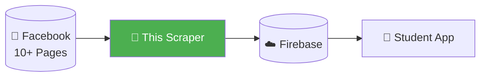
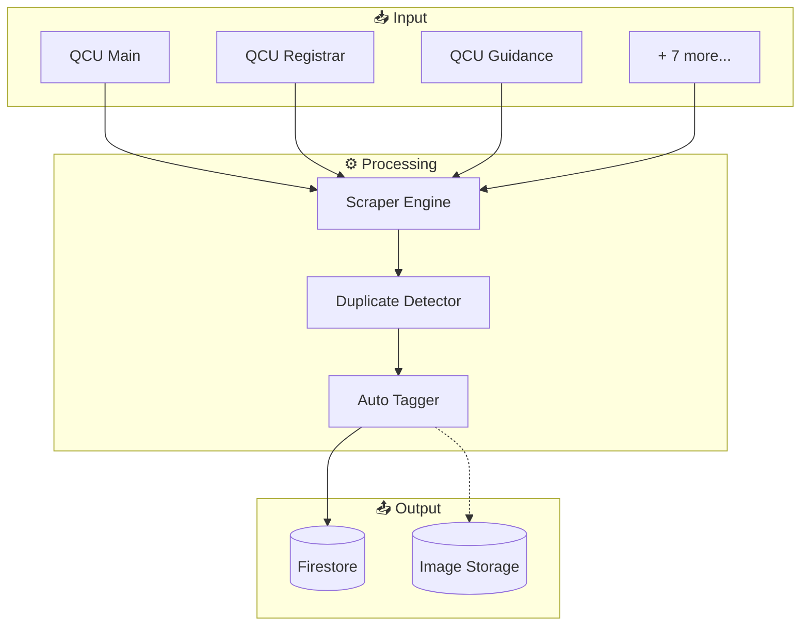

# 🎓 QCU News Scraper

> **Automated Facebook scraper for Quezon City University announcements**

[](https://www.python.org/)
[](https://firebase.google.com/)
[](LICENSE)
[]()

---

## 🎯 What is this?

A **scalable, flexible** Python scraper that centralizes QCU Facebook announcements into one feed.



### The Problem

- Students follow **10+ different Facebook pages**
- Important announcements get **missed**
- No **central place** to see all updates

### The Solution

This scraper automatically:
- ✅ Fetches posts from all official QCU pages
- ✅ Detects duplicates and reshares
- ✅ Tags content (URGENT, BSIT, ENTREP, etc.)
- ✅ Uploads to Firebase for the mobile app

---

## ⚡ Quick Start

### Prerequisites

- Python 3.11+
- Firebase account (free tier works)
- Git

### Installation

```bash
# Clone the repo
git clone https://github.com/yourusername/qcu-news-scraper.git
cd qcu-news-scraper

# Create virtual environment
python -m venv venv

# Activate (Windows)
venv\Scripts\activate

# Activate (macOS/Linux)
source venv/bin/activate

# Install dependencies
pip install -r requirements.txt
```

### Configuration

1. **Copy example config:**
   ```bash
   cp .env.example .env
   cp config/settings.example.json config/settings.json
   ```

2. **Add Firebase credentials:**
   - Download from Firebase Console → Project Settings → Service Accounts
   - Save as `config/firebase_config.json`

3. **Run the scraper:**
   ```bash
   python src/main.py
   ```

---

## 📚 Documentation

| Document | Description |
|----------|-------------|
| [GUIDE.md](./GUIDE.md) | **Development guide** - Detailed implementation docs |
| [QCU Unified Network.md](./QCU%20Unified%20Network.md) | **Architecture** - System design and flowcharts |

---

## 🏗️ Architecture Overview



---

## ✨ Features

| Feature | Status | Description |
|---------|--------|-------------|
| Multi-source scraping | ✅ | Scrape 10+ Facebook pages |
| Duplicate detection | ✅ | Skip already-scraped posts |
| Reshare detection | ✅ | Link reshares to original |
| Auto-tagging | ✅ | URGENT, BSIT, ENTREP, etc. |
| Title generation | ✅ | Generate titles from keywords |
| Image handling | ✅ | Compress and store images |
| Edit tracking | ✅ | Track post changes over time |
| Health monitoring | ✅ | Pre-flight checks before scraping |
| Discord alerts | ✅ | Get notified on failures |
| Priority system | ✅ | Scrape important sources first |
| Failure recovery | ✅ | Resume from where it stopped |

---

## 📁 Project Structure

```
qcu-news-scraper/
├── 📄 README.md              # You are here
├── 📄 GUIDE.md               # Development guide
├── 📄 QCU Unified Network.md # Architecture docs
├── 📄 requirements.txt       # Python dependencies
│
├── 📁 src/                   # Source code
│   ├── main.py               # Entry point
│   ├── scraper/              # Scraping modules
│   ├── processors/           # Data processing
│   ├── storage/              # Firebase client
│   └── monitoring/           # Health & alerts
│
├── 📁 config/                # Configuration
│   ├── sources.json          # FB pages to scrape
│   ├── keywords.json         # Tagging rules
│   └── settings.json         # App settings
│
└── 📁 tests/                 # Unit tests
```

---

## ⚙️ Configuration

### Sources (`config/sources.json`)

```json
{
  "sources": [
    {
      "id": "qcu1994",
      "name": "QCU Main",
      "url": "https://www.facebook.com/qcu1994",
      "priority": 1,
      "enabled": true
    }
  ]
}
```

### Keywords (`config/keywords.json`)

```json
{
  "urgency": ["SUSPENDED", "CANCELED", "URGENT"],
  "programs": ["BSIT", "BSCE", "ENTREP", "BSBA"],
  "categories": ["ENROLLMENT", "EXAM", "SCHOLARSHIP"]
}
```

---

## ⚠️ Limitations & Risks

| Risk | Severity | Mitigation |
|------|----------|------------|
| Facebook may block scraper | HIGH | Playwright backup + Admin Portal |
| `facebook-scraper` library outdated | HIGH | Monitoring for alternatives |
| Private groups need cookies | MEDIUM | Phase 2 implementation |

---

## 🤝 Contributing

1. Read [GUIDE.md](./GUIDE.md) first
2. Follow the design principles (Scalability, Simplicity, Readability)
3. Update documentation with code changes
4. Write tests for new features

---

## 📜 License

MIT License - See [LICENSE](./LICENSE) for details.

---

## 👥 Team

| Role | Name |
|------|------|
| Lead Architect | Brent Ford V. Remerata |
| Team | Platform Technologies Group |

---

## 🔗 Related Repositories

| Repo | Description |
|------|-------------|
| `qcu-student-app` | Flutter mobile app for students |
| `qcu-admin-portal` | Web portal for manual posting |

---

*Part of the QCU Unified Network project*
